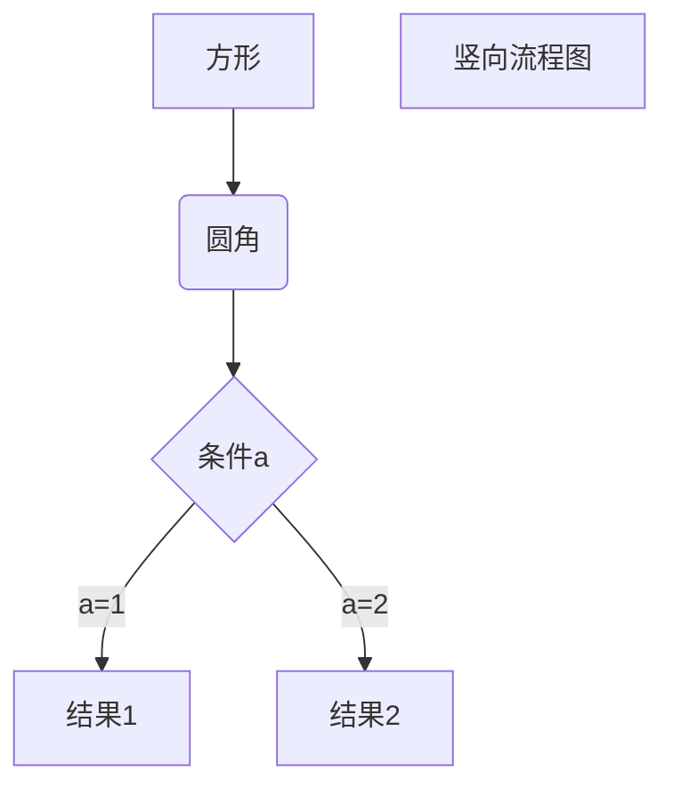

# cosmology notes
$$
\begin{aligned}
a &= b + c \\
&= d + e
\end{aligned}
$$

<u>**123**</u>

$\int_a^b f(x)dx$

```python
import numpy as np
```


```mermaid
graph TD
A[方形] --> B(圆角)
    B --> C{条件a}
    C --> |a=1| D[结果1]
    C --> |a=2| E[结果2]
    F[竖向流程图]
```
