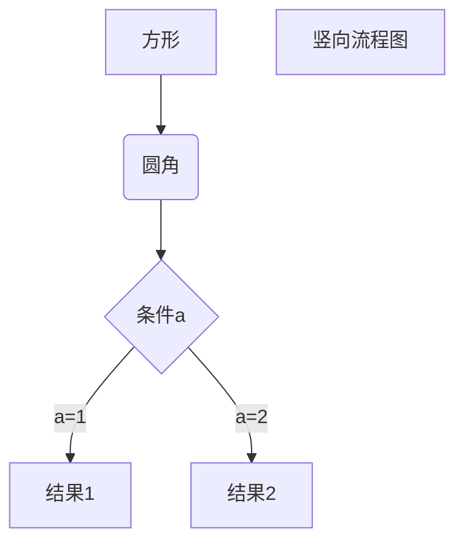
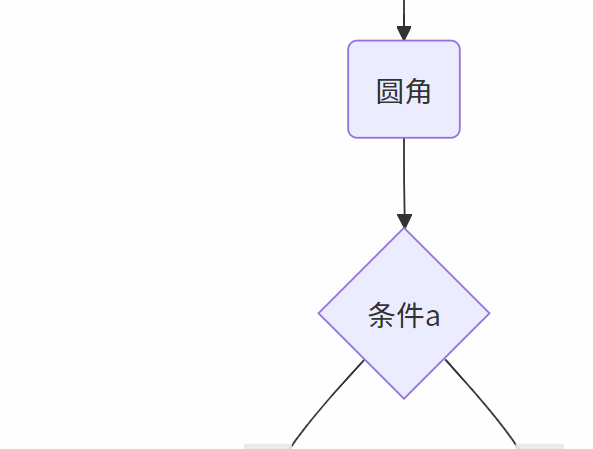

# cosmology notes


$$
\frac{\partial a}{\partial a} \\
\frac{\partial a}{\partial a} \\
$$

==123==

$\int_a^b f(x)dx$

H~2~O F^2^

```python
import numpy as np
```


```mermaid
graph TD
A[方形] --> B(圆角)
    B --> C{条件a}
    C --> |a=1| D[结果1]
    C --> |a=2| E[结果2]
    F[竖向流程图]
```


