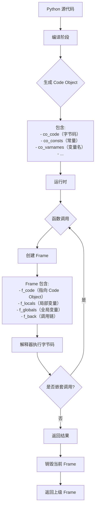
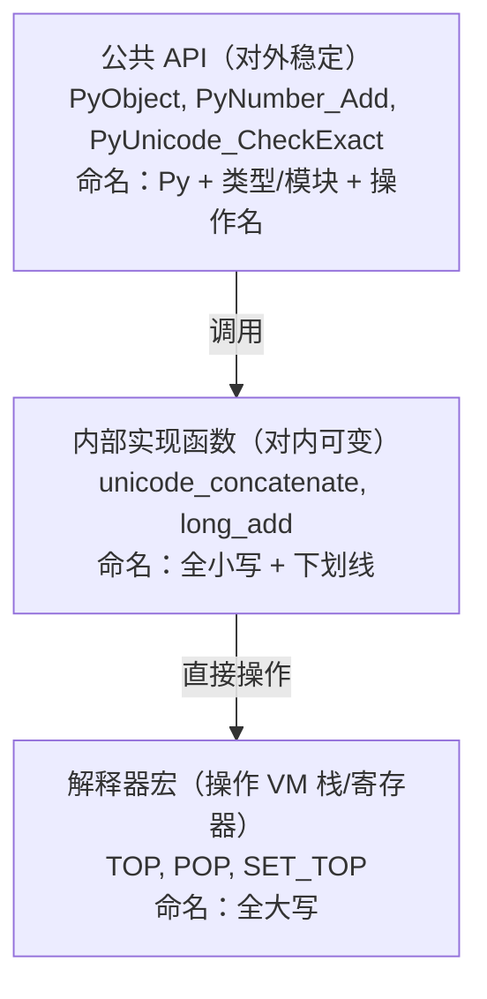

# Python notes

##  [不基础的 python 基础](https://www.bilibili.com/video/BV1ju411z7Sy?spm_id_from=333.788.videopod.sections&vd_source=257787b7f6ab2e896a4e167bf581bf17)

### 字节码和虚拟机？python代码竟然是这么执行的！

python 和 java 一样，并不是纯解释型语言


在虚拟机执行字节码之前会先生成栈 (frame), 所有的代码在 frame 中执行，除了最外面的 frame，都是一个 function call.

字节码指令可以进行计算或对虚拟机的栈进行操作（例如 `LOAD_FAST` 压栈， `BINARY_ADD` 将栈顶的两个数据加起来，然后再压回栈里 `RETURN_VALUE` 把栈顶数据返回），类似汇编，目标机器是python的虚拟机，或者说字节码是python虚拟机的汇编。。。

python 虚拟机不断地执行字节码，不断地生成新的frame，进行计算或者对frame进行操作，直到执行完毕，退出最外面的 frame

```python
import dis

def f(a,b):
    return a+b

dis.dis(f)
```


### B站没人讲过的CodeObject，python底层实现一点都不简单！

```python
def f1(a,b,/,c=10,*)
	return

def f2(a,b,*,c=10,*)
	return
```

`/` 前强制为固定位置参数，`*` 后强制为关键字参数

感觉这部分听听就好。。。有点复杂

> deepseek: 只有 **包含可执行代码** 的对象（如函数、生成器、方法、模块等）才会关联 code object，而普通数据对象或内置函数通常没有

### python的骨架frame——你写的代码都是运行在它里面的？

函数调用产生新的 frame, 层层嵌套，函数返回回到上一个frame，每个frame记录当前函数运行的临时信息，是一个 stack 的结构

总之就是 python 源代码会被编译成 字节码，其中可执行代码对象（主要形式是函数）就会被编译成 code object 来存储其众多属性。虚拟机先建立一个frame，然后每次函数调用生成一个新的frame, 这个frame记录当前的信息，包括 code object, 函数继续调用其他函数则会产生新的 frame， frame 中记录当前被调用函数的code object。函数返回则会销毁当前 frame.

code object 是死的，编译成字节码就固定了，每次运行时不同的信息则被记录在每次调用生成的 frame 中（当然 frame 也存储 code object）

总之python运行就是调用一系列的函数的过程。。。




### 看似简单的加法，背后究竟有多少代码需要运行？看了才知道！

python 的虚拟机以栈为基础

使用加法的时候转换为字节码 `BINARY_ADD`  :

```c
case TARGET(BINARY_ADD): {  
    PyObject *right = POP();                 // 从栈顶弹出右操作数对象（并减少栈指针）
    PyObject *left = TOP();                  // 获取当前栈顶元素（左操作数），但不弹出
    PyObject *sum;                           // 定义一个 PyObject 指针，用于存储加法结果

    /* NOTE(haypo): 请不要试图通过字节码在 CPython 中对 int+int 做微观优化，这是没有意义的。
       参考 http://bugs.python.org/issue21955 和 http://bugs.python.org/issue10044 讨论。
       总之，没有补丁能在真实基准测试中显示出性能提升，只有在微基准测试中才有轻微加速。 */

    if (PyUnicode_CheckExact(left) &&         // 检查左操作数是否是精确的 Unicode 对象
        PyUnicode_CheckExact(right)) {        // 检查右操作数是否是精确的 Unicode 对象
        sum = unicode_concatenate(            // 如果两个操作数都是 Unicode，则执行字符串拼接
            tstate, left, right, f, next_instr
        );
        /* unicode_concatenate 会消耗 left 的引用计数 */
    }
    else {                                    // 如果不是两个 Unicode
        sum = PyNumber_Add(left, right);      // 调用通用的 PyNumber_Add，执行加法运算（可处理数字、序列等）
        Py_DECREF(left);                      // 减少左操作数的引用计数
    }

    Py_DECREF(right);                         // 减少右操作数的引用计数
    SET_TOP(sum);                             // 将结果放到栈顶（覆盖原先的 left）
    if (sum == NULL)                          // 如果加法失败（返回 NULL）
        goto error;                           // 跳转到错误处理
    DISPATCH();                               // 跳转到下一条字节码指令执行
}
```




后面太复杂了。。。

总之python add 慢的原因主要是 1. python 灵活的类型和重载的实现需要不断地做类型检查，重载检查 2. python 的加法需要返回一个新的 PyObject 对象(而不仅仅是C语言层面的加)，建立这个新的 PyObject 会有很多性能损耗 （当数比较大的时候）

### GIL（global intepreter lock）

似乎是由于多进程之间共享变量，因此会有竞争冒险(racing) 的问题，肯可能导致同一个变量被以不是预期的方式被更改。python 内存管理是基于引用计数（而且不是 atomic 的，也就是线程之间会会互相干扰），因此多线程之间的竞争冒险可能会导致引用计数数错，导致内存泄漏。简单的解决方式是加锁

```python
a = 1
lock.aquire()
if a > 0:
    a-=1
lock.release()
```

在加锁期间，其他线程无法对 a 进行修改。除了引用计数，python中所有跟python object 有关的代码，都有可能有这个问题。因此设计了全局锁GIL ，GIL 的好处是

1. 简单，不容易出错，维护简单
2. 只有一个线程锁，避免了死锁的问题（一个线程有两个以上的锁的时候就有可能发生死锁的问题）
3. 对于单线程或者没办法并行的多线程程序，GIL的性能很好，因为只需要加一次锁，但是如果为每个python object单独设计一个锁，就需要加很多次
4. 写 c extension 变得容易，因为可以确定一个字节码在运行的时候没有竞争冒险的问题，c 中就可以不用管锁的问题
5. backward compatibility 向后兼容

GIL 的问题

python 的 interpreter 只允许一个线程运行 bytecode，因此python 的多线程没有办法利用多核。

解决方法:

1. 多个进程利用多核（multiprocessing)
2. 自己写 c extension, 在 c 的层面去做多线程，也就是多个线程运行的实际上是c代码而不是python代码，要自己解决竞争冒险的问题
3. 用没有 GIL 的python 解释器, 例如 Jython， IronPython


### 描述器

`__get__,__set__,__delete__` 定义任何一个的类都会自动变成 descriptor

如果 `__get__(), __set__()` 都有， 优先使用 descriptor，如果不是，去自己的`__dict__()` 里面找，如果找不到，最后再尝试 `__get__()` , 如果 `__get__()` 未定义，则原样返回.


### 详解变量作用域，局部闭包还是全局？

全局变量，局部变量，闭包变量，判断变量的作用域遵循由内而外的原则（内部优先）

一般的全局变量作用域局限在单个python文件（module），builtins 内置变量的作用域才是真全局，虽然都是全局变量，但是其实是两个不同的作用域

module level 优先级高于真全局，（也算一种内部优先?） 因此可以覆盖内置变量定义。。。，但是可以用 `del` 来删除module level 的变量，来恢复内置变量

```python
print='hello world'
del print
```

想要修改内置变量，可以

```python
import builtins
builtins.print='hello world'
```

虽然没有什么实际用处。。。

**闭包**就是外层函数中定义的变量被内部函数使用，可以理解为**外层函数作用域内的全局变量**。

**python 除了在定义函数之外，不会产生新的局部作用域**，例如函数中的循环中的变量，在循环外（仍在函数内）也是可以使用，并且循环后会被赋值为最后一个循环变量的值（而 C语言中就不行）

```python
for x in range(10):
    pass
print(x)
```

例如上面的代码输出的是9，但是**列表解析是个例外**，3.11之前列表解析会生成一个函数，循环变量在该函数作用域内，3.12之后做到了真正inline,因此下面代码打印为0

```python
x = 0
lst = [x for x in range(10)]
print(x)
```

列表解析中的 x 是局部变量，会用`LOAD_FAST`

### 使用coveragepy计算单元测试的覆盖率

貌似暂时用不到。。。

### 循环引用

平时占时间的垃圾回收其实是在检索循环引用，如果类只剩内部的引用，也可以被自动释放，可以通过 `gc.collect()` 手动释放

1. 垃圾回收不是实时的，需要隔一段时间回收一次
2. 检查循环引用的算法很复杂，比较耗时，因为循环引用可能很复杂

循环引用有时可以看做内存泄漏的一种，但是用python貌似还是不用担心内存的问题，只了解一下可能出现内存泄漏的原理就好	

### pyi文件是干啥的？函数实现怎么是空的？

pyi 是用于声明扩展力有哪些类，函数的文件。如果以后需要写python的c扩展，可以学一下，写完这个文件之后IDE就会有提示了。

