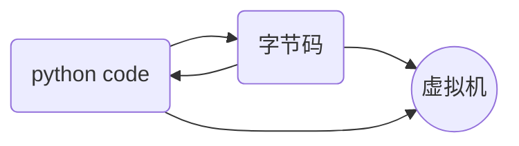
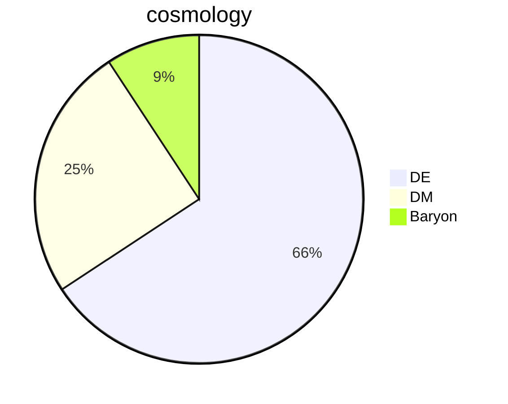

# Python notes

## 不基础的 python 基础

### 字节码和虚拟机？python代码竟然是这么执行的！

所有的代码在 frame 中执行，除了最外面的 frame，都是一个 function call.

字节码类似汇编，目标机器是python的虚拟机，即

```mermaid
flowchart LR
	A(python code)
	B(字节码)
	C((虚拟机))
	A --> B --> C
	A --> C
	B -->A
```

```mermaid
pie
title cosmology 
"DE": 71
"DM": 27
"Baryon": 10
```

test