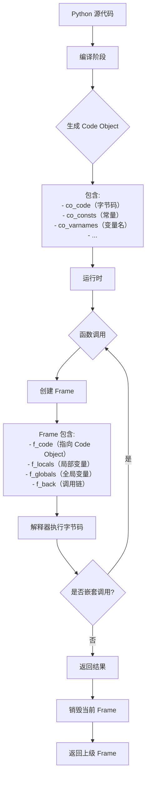

# Python notes

##  [不基础的 python 基础](https://www.bilibili.com/video/BV1ju411z7Sy?spm_id_from=333.788.videopod.sections&vd_source=257787b7f6ab2e896a4e167bf581bf17)

### 字节码和虚拟机？python代码竟然是这么执行的！

python 和 java 一样，并不是纯解释型语言


在虚拟机执行字节码之前会先生成栈 (frame), 所有的代码在 frame 中执行，除了最外面的 frame，都是一个 function call.

字节码指令可以进行计算或对虚拟机的栈进行操作（例如 `LOAD_FAST` 压栈， `BINARY_ADD` 将栈顶的两个数据加起来，然后再压回栈里 `RETURN_VALUE` 把栈顶数据返回），类似汇编，目标机器是python的虚拟机，或者说字节码是python虚拟机的汇编。。。

python 虚拟机不断地执行字节码，不断地生成新的frame，进行计算或者对frame进行操作，直到执行完毕，退出最外面的 frame

### B站没人讲过的CodeObject，python底层实现一点都不简单！

```python
def f1(a,b,/,c=10,*)
	return

def f2(a,b,*,c=10,*)
	return
```

`/` 前强制为固定位置参数，`*` 后强制为关键字参数

感觉这部分听听就好。。。有点复杂

> deepseek: 只有 **包含可执行代码** 的对象（如函数、生成器、方法、模块等）才会关联 code object，而普通数据对象或内置函数通常没有

### python的骨架frame——你写的代码都是运行在它里面的？

函数调用产生新的 frame, 层层嵌套，函数返回回到上一个frame，每个frame记录当前函数运行的临时信息，是一个 stack 的结构

总之就是 python 源代码会被编译成 字节码，其中可执行代码对象（主要形式是函数）就会被编译成 code object 来存储其众多属性。虚拟机先建立一个frame，然后每次函数调用生成一个新的frame, 这个frame记录当前的信息，包括 code object, 函数继续调用其他函数则会产生新的 frame， frame 中记录当前被调用函数的code object。函数返回则会销毁当前 frame.

code object 是死的，编译成字节码就固定了，每次运行时不同的信息则被记录在每次调用生成的 frame 中（当然 frame 也存储 code object）

总之python运行就是调用一系列的函数的过程。。。




### 看似简单的加法，背后究竟有多少代码需要运行？看了才知道！