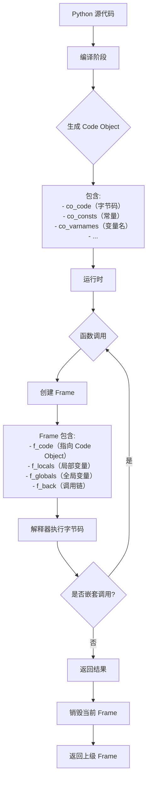
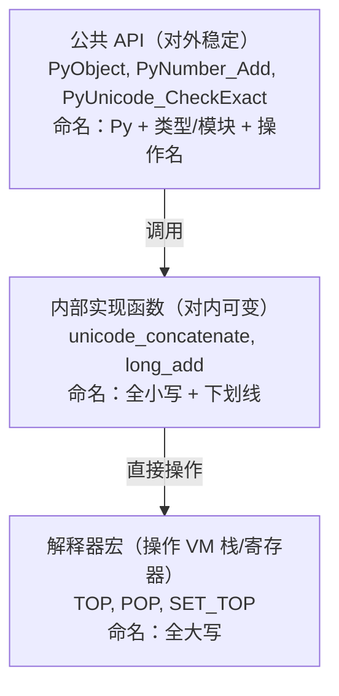
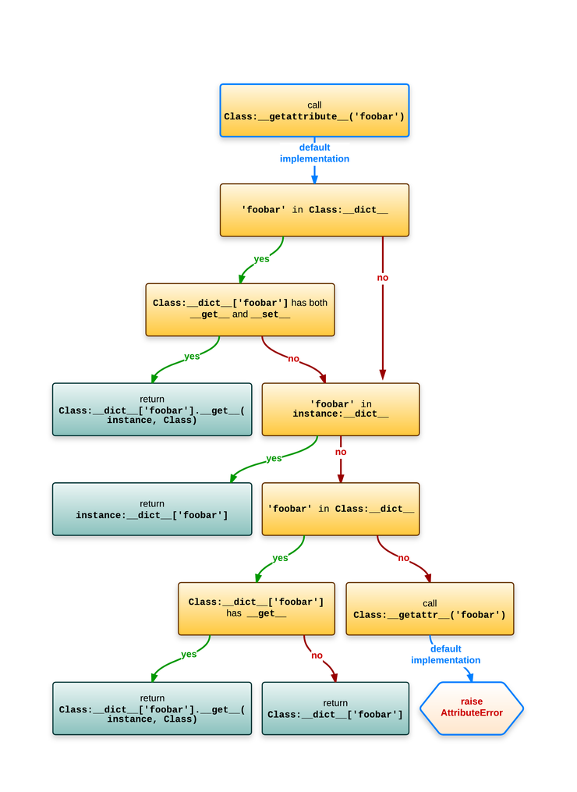

# Python notes

## python 环境配置

### vscode jupyter extension 远程连接 ubuntu 服务器， tmux 保持 jupyter 会话

首先为了方便，在服务器 `.bashrc` 中写入tmux相关的命令

```bash
# tmux commands
tmuxList(){
  tmux ls
}

tmuxKill(){
  tmux kill-session -t $1
}

tmuxNew(){
  tmux new -s $1
}

tmuxAttach(){
  tmux attach -t $1
}

tmuxDetach(){
  tmux detach
}

tmuxKillAll(){
  tmux kill-server
}

tmuxSource(){
  tmux source-file ~/.tmux.conf
}

tmuxConfig(){
  vim ~/.tmux.conf
}
```

然后新建一个 tmux session

```bash
tmuxNew jupyter
```

在这个 session 中激活你要用的 python 环境

```bash
conda activate python_env_name
```

在这个环境下启动 jupyter 服务

```bash
jupyter notebook --no-browser --port=1314
```

有时候这个端口会被占用, 如果需要的话，可以用下面的命令查询 jupyter 进程，然后杀掉

```bash
 ps -aux | grep jupyter
```

开启jupyter服务后，将输出的代码中的地址复制下来，形如

 http://localhost:8080/tree?token=xxx

然后在 vscode 链接好的服务器中，打开一个你想要编辑的jupyter 文件，点击`选择内核` ,`选择其他内核`，选择`现有jupyter服务器` , 然后输入上面复制的地址，回车就好，这样即使在本地关闭了 vscode, 下次打开链接服务器后，这个jupyter notebook 文件的变量还都存在，可以说是非常方便了。

也可以把上面的端口地址http://localhost:8080/复制到浏览器（用vscode 链接到服务器后就能打开），可以本地打开传统的 jupyter 界面，里面有显示正在 running 的文件，可以手动关闭。

需要注意的点是，**最好在代码文件夹内开启这个jupyter 服务**，否则 import 自定义模块的时候似乎有点问题，例如，如果你的根路径是

```bash
root
	data code fig
```

你自定义的模块写在 code 里， 但你的服务是在 root 文件夹中开启的，那么这样 import 的时候就找不到。。。，所以最好进入到 code 里，然后再开启服务，这样就完美了。。。虽然在root文件夹中开启应该也有办法设置路径，但我偷懒，就不去研究了

另外的问题是这个可以恢复的kernel **有时候matplotlib 画的图会不显示**，这时候需要重新运行一遍

```python
%matplotlib inline
```

就好用了，非常玄学。。。

另外就是，要连接的服务器用有线，把wifi关了，不知道为什么 wifi 的优先级比有线高，连不上。。。

##  [不基础的 python 基础](https://www.bilibili.com/video/BV1ju411z7Sy?spm_id_from=333.788.videopod.sections&vd_source=257787b7f6ab2e896a4e167bf581bf17)

### 字节码和虚拟机？python代码竟然是这么执行的！

python 和 java 一样，并不是纯解释型语言


在虚拟机执行字节码之前会先生成栈 (frame), 所有的代码在 frame 中执行，除了最外面的 frame，都是一个 function call.

字节码指令可以进行计算或对虚拟机的栈进行操作（例如 `LOAD_FAST` 压栈， `BINARY_ADD` 将栈顶的两个数据加起来，然后再压回栈里 `RETURN_VALUE` 把栈顶数据返回），类似汇编，目标机器是python的虚拟机，或者说字节码是python虚拟机的汇编。。。

python 虚拟机不断地执行字节码，不断地生成新的frame，进行计算或者对frame进行操作，直到执行完毕，退出最外面的 frame

```python
import dis

def f(a,b):
    return a+b

dis.dis(f)
```


### B站没人讲过的CodeObject，python底层实现一点都不简单！

```python
def f1(a,b,/,c=10,*)
	return

def f2(a,b,*,c=10,*)
	return
```

`/` 前强制为固定位置参数，`*` 后强制为关键字参数

感觉这部分听听就好。。。有点复杂

> deepseek: 只有 **包含可执行代码** 的对象（如函数、生成器、方法、模块等）才会关联 code object，而普通数据对象或内置函数通常没有

### python的骨架frame——你写的代码都是运行在它里面的？

函数调用产生新的 frame, 层层嵌套，函数返回回到上一个frame，每个frame记录当前函数运行的临时信息，是一个 stack 的结构

总之就是 python 源代码会被编译成 字节码，其中可执行代码对象（主要形式是函数）就会被编译成 code object 来存储其众多属性。虚拟机先建立一个frame，然后每次函数调用生成一个新的frame, 这个frame记录当前的信息，包括 code object, 函数继续调用其他函数则会产生新的 frame， frame 中记录当前被调用函数的code object。函数返回则会销毁当前 frame.

code object 是死的，编译成字节码就固定了，每次运行时不同的信息则被记录在每次调用生成的 frame 中（当然 frame 也存储 code object）

总之python运行就是调用一系列的函数的过程。。。




### 看似简单的加法，背后究竟有多少代码需要运行？看了才知道！

python 的虚拟机以栈为基础

使用加法的时候转换为字节码 `BINARY_ADD`  :

```c
case TARGET(BINARY_ADD): {  
    PyObject *right = POP();                 // 从栈顶弹出右操作数对象（并减少栈指针）
    PyObject *left = TOP();                  // 获取当前栈顶元素（左操作数），但不弹出
    PyObject *sum;                           // 定义一个 PyObject 指针，用于存储加法结果

    /* NOTE(haypo): 请不要试图通过字节码在 CPython 中对 int+int 做微观优化，这是没有意义的。
       参考 http://bugs.python.org/issue21955 和 http://bugs.python.org/issue10044 讨论。
       总之，没有补丁能在真实基准测试中显示出性能提升，只有在微基准测试中才有轻微加速。 */

    if (PyUnicode_CheckExact(left) &&         // 检查左操作数是否是精确的 Unicode 对象
        PyUnicode_CheckExact(right)) {        // 检查右操作数是否是精确的 Unicode 对象
        sum = unicode_concatenate(            // 如果两个操作数都是 Unicode，则执行字符串拼接
            tstate, left, right, f, next_instr
        );
        /* unicode_concatenate 会消耗 left 的引用计数 */
    }
    else {                                    // 如果不是两个 Unicode
        sum = PyNumber_Add(left, right);      // 调用通用的 PyNumber_Add，执行加法运算（可处理数字、序列等）
        Py_DECREF(left);                      // 减少左操作数的引用计数
    }

    Py_DECREF(right);                         // 减少右操作数的引用计数
    SET_TOP(sum);                             // 将结果放到栈顶（覆盖原先的 left）
    if (sum == NULL)                          // 如果加法失败（返回 NULL）
        goto error;                           // 跳转到错误处理
    DISPATCH();                               // 跳转到下一条字节码指令执行
}
```




后面太复杂了。。。

总之python add 慢的原因主要是 1. python 灵活的类型和重载的实现需要不断地做类型检查，重载检查 2. python 的加法需要返回一个新的 PyObject 对象(而不仅仅是C语言层面的加)，建立这个新的 PyObject 会有很多性能损耗 （当数比较大的时候）

### GIL（global intepreter lock）

似乎是由于多进程之间共享变量，因此会有竞争冒险(racing) 的问题，肯可能导致同一个变量被以不是预期的方式被更改。python 内存管理是基于引用计数（而且不是 atomic 的，也就是线程之间会会互相干扰），因此多线程之间的竞争冒险可能会导致引用计数数错，导致内存泄漏。简单的解决方式是加锁

```python
a = 1
lock.aquire()
if a > 0:
    a-=1
lock.release()
```

在加锁期间，其他线程无法对 a 进行修改。除了引用计数，python中所有跟python object 有关的代码，都有可能有这个问题。因此设计了全局锁GIL ，GIL 的好处是

1. 简单，不容易出错，维护简单
2. 只有一个线程锁，避免了死锁的问题（一个线程有两个以上的锁的时候就有可能发生死锁的问题）
3. 对于单线程或者没办法并行的多线程程序，GIL的性能很好，因为只需要加一次锁，但是如果为每个python object单独设计一个锁，就需要加很多次
4. 写 c extension 变得容易，因为可以确定一个字节码在运行的时候没有竞争冒险的问题，c 中就可以不用管锁的问题
5. backward compatibility 向后兼容

GIL 的问题

python 的 interpreter 只允许一个线程运行 bytecode，因此python 的多线程没有办法利用多核。

解决方法:

1. 多个进程利用多核（multiprocessing)
2. 自己写 c extension, 在 c 的层面去做多线程，也就是多个线程运行的实际上是c代码而不是python代码，要自己解决竞争冒险的问题
3. 用没有 GIL 的python 解释器, 例如 Jython， IronPython


### 描述器

#### 定义

`__get__,__set__,__delete__` 定义任何一个的类都会自动变成 descriptor

#### 触发时机

`__get__,__set__,__delete__`  分别在取类属性（`.` 运算符），赋值（`=`）， 删除（`del`） 时触发

描述器在作为其他类的类属性时才会被触发, 例如下面这段代码会打印一个 Name() 对象，因为描述器是在`__init__` 内定义的一个属性，即对象属性，存在于`o.__dict__` 中，而不是 class A 的类属性(即不存在于 `A.__dict__`） 中

```python
class Name:
    def __get__(self, obj, objtype):
        return "Peter"

class A:
    def __init__(self) -> None:
        self.name = Name()  

o = A()
print(o.name)
```

要想触发，只需改成:

```python
class Name:
    def __get__(self, obj, objtype):
        return "Peter"

class A:
    name = Name()  

o = A()
print(o.name)
```

#### 触发优先级

如果 `__get__(), __set__()` 同时存在， 优先使用 descriptor，如果只有`__get__`，则去实例的`__dict__()` 里面找，如果找不到，再回来尝试 `__get__()` , 如果 `__get__()` 未定义，则原样返回 self:

[python - python 属性的 get 和 set order 是什么？- 堆栈溢出 --- class - What is the python attribute get and set order? - Stack Overflow](https://stackoverflow.com/questions/30961069/what-is-the-python-attribute-get-and-set-order)



总之描述符还是蛮复杂的。。。了解就好

### 装饰器超详细教学，用尽毕生所学给你解释清楚，以后再也不迷茫了！

本质上是语法糖, 可以看做输入和输出都是函数的函数（尽管输入一定是函数，输出不一定），广义上来说，不一定是函数，只要是 callable 就可以, 因此定义了 `__call__` 的类也可以作为装饰器.

不带参数的装饰器等价于 `func = dec(func)`,  带参数的装饰器等价于 `func = dec(param)(func)`：

```python
import time


# 等价于 func = timeit(func)
def timeit(func):
    def inner(*args,**kwargs):
        start = time.time()
        ret = func(*args,**kwargs)
        end = time.time()
        print(f'time: {end-start}')
        return ret
    return inner

# 带参数的装饰器，等价于 func = timeit_param(n)(func)
def timeit_param(n):
    def middle(func):
        def inner(*args,**kwargs):
            start = time.time()
            for _ in range(n):
                ret = func(*args,**kwargs)
            end = time.time()
            print(f'10 time: {end-start}')
            return ret
        return inner
    return middle

@timeit
def add(a,b):
    time.sleep(2)
    return a+b

@timeit_param(10)
def add(a,b):
    time.sleep(0.1)
    return a+b
```

### 一个公式解决所有复杂的装饰器，理解了它以后任何装饰器都易如反掌！

```python
# 装饰器类
#公式: func = Timer(func)
class Timer:
    def __init__(self, func):
        self.func = func
    def __call__(self, *args, **kwargs):
            start = time.time()
            ret = self.func(*args,**kwargs)
            end = time.time()
            print(f'time: {end-start}')
            return ret

@Timer
def add_class(a,b):
    time.sleep(2)
    return a+b

add_class(1,2) 

#公式: func = Timer(prefix)(func)
class TimerPrefix:
    def __init__(self, prefix):
        self.prefix = prefix
    def __call__(self, func):
        def inner(*args,**kwargs):
            start = time.time()
            ret = func(*args,**kwargs)
            end = time.time()
            print(f'{self.prefix} time: {end-start}')
            return ret
        return inner

@TimerPrefix('hello')
def add_class(a,b):
    time.sleep(2)
    return a+b

add_class(1,2) 
```


```python
# 装饰类的装饰器 class = dec(class), 例如可以对类的魔术方法修改，实现print 打印class 成员函数的功能
def dec(cls):
    def __str__(self):
        return str(self.__dict__)
    cls.__str__ = __str__
    return cls

@dec
class MyClass:
    def __init__(self,a,b):
        self.a = a 
        self.b = b 
    

my_class = MyClass(1,2)
print(my_class)

# class = dec(param)(class)
def dec_param(param):
    def inner(cls):
        def __str__(self):
            return param+str(self.__dict__)
        cls.__str__=__str__
        return cls
    return inner


@dec_param('hello')
class MyClassParam:
    def __init__(self,a,b):
        self.a = a 
        self.b = b 
    
my_class_param = MyClassParam(1,2)
print(my_class_param)
```

### 如何在class内部定义一个装饰器？这里的坑你要么不知道，要么不会填！

`@classmethod` 将装饰器转换成类方法，但是这样装饰器函数的第一个参数必须是 `class`

当仅需要把一些装饰器封装到一个类中的时候，`@staticmethod` 是一个很好的方法, 例如

```python
class Decorators:
    @staticmethod
    def dec1(func):
        return func
    
    @staticmethod
    def dec2(func):
        return func
```

如果想用类内装饰器装饰类内的其他函数，可以直接定义一个不是类方法，即**没有 self 参数的辅助函数`dec`**作为装饰器，但是如果你还想在类外，通过对象调用这个不是类方法的函数，可以在类内的最后，加上一句`dec = staticmethod(dec)`

```python
class Decorators:
    def dec(func):
        return func
    
    @dec
    def method1(a,b):
        return a+b
    
    dec = staticmethod(dec) 
```

本质和 @staticmethod 加在 dec 前面是一样的，但是允许在dec 定义之后才把dec转变为静态方法，而用装饰器定义 @staticmethod 只能在dec定义的时候装饰dec，如果这样，dec就无法装饰这里的 method1 了（报错 staticmethod is not callable）。不过这个报错只存在于 3.9 之前，于是 `python 3.10` 之后可以直接用

```python
class Decorators:
    @staticmethod
    def dec(func):
        return func
    
    @dec
    def method1(a,b):
        return a+b
```

这样 dec 在类内可以装饰类内的函数，同时可以通过 `@Decorators.dec`, 或者 `d = Decorators, @d.dec` 去装饰类外的函数

### 对迭代器一知半解？看完这个视频就会了。涉及的每个概念，都给你讲清楚！

包含了 `__next__` 和 `__iter__` 方法的对象就是迭代器，`__iter__` 一般返回迭代器自身。`__next__` 用于获取下一个迭代器，直到容器内的所有数据被迭代完，`raise` 一个 `StopIteration` 异常

### 生成器是什么？怎么用？能干啥？一期视频解决你所有疑问！

有 `yield` 的函数为生成器函数，生成器函数**返回生成器对象**，而**不是这个函数的返回值**。。。生成器函数的 return 不管返回什么，都等价于 `raise` 一个 `StopIteration` 异常。生成器函数不写 `return` 和 `return None` 是一样的


从使用者的角度，生成器和迭代器没有区别，使用方法几乎一样

从原理来看，迭代器把状态储存到迭代器对象中，生成器把状态保存在`frame` 中, 状态是函数运行到哪一步了，

通常生成器会比迭代器简洁

生成器的高级用法 send

```python
def gen(num):
    while num > 0:
        tmp = yield num
        if tmp is not None:
            print(tmp)
            num = tmp
        num-=1

g = gen(5)
first = next(g) # 等价于 first = g.send(None)

print(f'first: {first}')
print(f'send: {g.send(10)}') # 相当于把 tmp 赋值为 10，然后继续运行到下一次yield，输出9 

for i in g:
    print(i)
```

```none
first: 5
10
send: 9
8
7
6
5
4
3
2
1
```

send 函数提供一个机制，可以去和生成器交流，改变生成器的状态

### 闭包的实现机制。嵌套函数怎么共享变量的？

闭包即从一个函数去读取另外一个函数的变量的机制

会建立 `cell object` 闭包变量存储在这个对象中，而函数对象引用了这个 cell object, 可以通过 `__closure__` 查看

```python
def f():
    data = []

    def inner(value):
        data.append(value)
        return data
    
    return inner

g = f()
print(g.__closure__)
print(g(1))
print(g(2))
print(hex(id(g(3))))
```

```
(<cell at 0x0000026FF0DCD870: list object at 0x0000026FF141C9C0>,)
[1]
[1, 2]
0x26ff141c9c0
```

可以看到，data 存活在g的引用下

对于函数g 来说，data 就是一个全局变量， f 的作用就是建立了一个小的“全局”作用域，即使f 已经不存在，闭包变量还可以活在 函数对象的引用中。。。


### python中什么会被当真？你知道if判断背后的规则吗？

`==` 值判断 `is` 地址判断

```python
if a:
    print('true')
```

a 如果是内置数据类型，如果是数字，0 返回 False  ，1 返回 True

a 如果是字典或者list，返回长度

a 如果是自己定义的类型，python 会去找 `__len__` 和 `__bool__` 调用这两个函数；

如果 `__len__`, `__bool__` 都没有，直接返回 `True` . 如果有，根据这两个函数的返回值确定最终的 True or False, 且如果两者同时存在 `__bool__` 的优先级更高


### 你知道定义class背后的机制和原理嘛？当你定义class的时候，python实际运行了什么呢？

建立class 的时候，相当于

1. 运行一遍class 内部的代码
2. 将产生的所有局部变量的值都保存到 class 的 `.__dict__`  中
3. 建立一个 type, 赋值给 class 的名字的变量

```python
def f(self):
    print(1)

d = {
    'name' : 'AAA',
    'f' : f
}

A = type('A',(),d)

print(A.__dict__)

a = A()
```


### metaclass理解加入门，看完就知道什么是元类了。

复杂。。。暂时用不到


### 详解变量作用域，局部闭包还是全局？

全局变量，局部变量，闭包变量，判断变量的作用域遵循由内而外的原则（内部优先）

一般的全局变量作用域局限在单个python文件（module），builtins 内置变量的作用域才是真全局，虽然都是全局变量，但是其实是两个不同的作用域

module level 优先级高于真全局，（也算一种内部优先?） 因此可以覆盖内置变量定义。。。，但是可以用 `del` 来删除module level 的变量，来恢复内置变量

```python
print='hello world'
del print
```

想要修改内置变量，可以

```python
import builtins
builtins.print='hello world'
```

虽然没有什么实际用处。。。

**闭包**就是外层函数中定义的变量被内部函数使用，可以理解为**外层函数作用域内的全局变量**。

**python 除了在定义函数之外，不会产生新的局部作用域**，例如函数中的循环中的变量，在循环外（仍在函数内）也是可以使用，并且循环后会被赋值为最后一个循环变量的值（而 C语言中就不行）

```python
for x in range(10):
    pass
print(x)
```

例如上面的代码输出的是9，但是**列表解析是个例外**，3.11之前列表解析会生成一个函数，循环变量在该函数作用域内，3.12之后做到了真正inline,因此下面代码打印为0

```python
x = 0
lst = [x for x in range(10)]
print(x)
```

列表解析中的 x 是局部变量，会用`LOAD_FAST`

### 使用coveragepy计算单元测试的覆盖率

貌似暂时用不到。。。

### 循环引用

平时占时间的垃圾回收其实是在检索循环引用，如果类只剩内部的引用，也可以被自动释放，可以通过 `gc.collect()` 手动释放

1. 垃圾回收不是实时的，需要隔一段时间回收一次
2. 检查循环引用的算法很复杂，比较耗时，因为循环引用可能很复杂

循环引用有时可以看做内存泄漏的一种，但是用python貌似还是不用担心内存的问题，只了解一下可能出现内存泄漏的原理就好	

### pyi文件是干啥的？函数实现怎么是空的？

pyi 是用于声明扩展力有哪些类，函数的文件。如果以后需要写python的c扩展，可以学一下，写完这个文件之后IDE就会有提示了。

